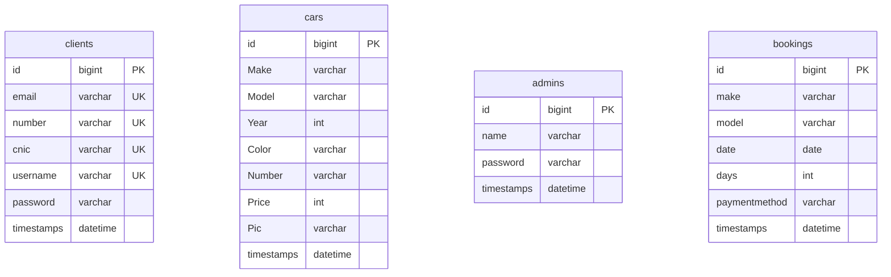

# 🚗 Rent-Car

[](https://laravel.com)
[](https://www.php.net)
[](https://opensource.org/licenses/MIT)

A modern, responsive, and robust **Car Rental Management System** built with **Laravel**. It features a clean web interface for clients to browse, search, and book cars, and a secure dashboard for administrators to manage the car fleet and bookings.

---

## 🌟 Features

### 👤 Client Panel
- **User Authentication**: Secure registration and login portals.
- **Car Catalog**: Interactive car listing displaying available vehicles with high-quality images.
- **Search & Filters**: Real-time vehicle searching by model or make.
- **Detailed Specifications**: View comprehensive specifications (make, model, color, price per day) of individual vehicles.
- **Booking Engine**: Reserve cars for specified dates and durations, with multiple payment methods supported.

### 🔑 Admin Dashboard
- **Fleet Management (CRUD)**: Easily add new cars (with image uploads), view details, update specifications, or delete cars from the system.
- **Booking Tracking**: Monitor all active bookings and manage reservations.
- **System Control**: Cancel bookings or remove outdated records as needed.

---

## 🛠️ Technology Stack

- **Backend Framework**: Laravel
- **Language**: PHP (8.0+)
- **Frontend**: Blade Templates, Vanilla CSS, Vite (Asset Bundling)
- **Database**: MySQL / MariaDB (managed via Eloquent ORM & Migrations)
- **Session Management**: Native Laravel sessions for secure user/admin logins

---

## 📁 Database Schema

The application database structure is modeled around 4 main entities:



---

## 🗺️ Application Routing Structure

The application's logic is cleanly split into specialized routes for Clients and Administrators:

### Public & Client Routes
* **Home / Landing**: `GET /`
* **Authentication**: `GET /raclogin` (Login Page) | `GET /racsignup` (Signup Page)
* **Actions**: 
  - `POST /add` — Client registration (`ClientController@addClient`)
  - `POST /check` — Client / Admin authentication (`ClientController@checkClient`)
  - `GET /logout` — Ends current client session
* **Car Catalog & Details**: 
  - `GET /carlisting` — All available cars (`CarController@carlisting`)
  - `GET /carlisting/{term}` — Search cars by name/model
  - `GET /viewcar/{id}` — In-depth car specs (`CarController@viewCar`)
* **Bookings**:
  - `GET /bookCar/{id}` — Pre-populate booking details (`CarController@bookCar`)
  - `POST /addBooking` — Confirm booking details (`BookingController@addBooking`)

### Admin Dashboard Routes
* **Dashboard**: `GET /admindashboard`
* **Authentication**: `GET /adminlogout` — Ends admin session
* **Fleet Control**:
  - `GET /showCars` — Admin fleet table list (`CarController@showCars`)
  - `GET /addnewcar` — Page to add new vehicles
  - `POST /addCar` — Upload and save new car details (`CarController@addCar`)
  - `GET /updateCarPage/{id}` — Form to edit vehicle information (`CarController@updateCarPage`)
  - `POST /updateCar/{id}` — Save edited specifications (`CarController@updateCar`)
  - `GET /deleteCar/{id}` — Delete a vehicle listing (`CarController@deleteCar`)
* **Booking Control**:
  - `GET /showBookings` — View all rental transactions (`BookingController@showBookings`)
  - `GET /deleteBooking/{id}` — Delete/cancel booking (`BookingController@deleteBooking`)

---

## 🚀 Installation & Setup Guide

Follow these steps to set up the project locally on your machine:

### Prerequisites
Make sure you have the following installed:
- PHP (>= 8.0)
- Composer
- Node.js & NPM
- MySQL / MariaDB

### 1. Clone the Repository
```bash
git clone https://github.com/muhammadammar33/Rent-Car.git
cd Rent-Car
```

### 2. Install Backend Dependencies
```bash
composer install
```

### 3. Install Frontend Dependencies & Build Assets
```bash
npm install
npm run build
```

### 4. Configure Environment Files
Copy the template `.env.example` file and generate an application key:
```bash
cp .env.example .env
php artisan key:generate
```

Open the newly created `.env` file and configure your database settings:
```ini
DB_CONNECTION=mysql
DB_HOST=127.0.0.1
DB_PORT=3306
DB_DATABASE=rent_car
DB_USERNAME=root
DB_PASSWORD=your_secure_password
```

### 5. Run Database Migrations
Create the necessary database tables:
```bash
php artisan migrate
```

### 6. Set Up File Storage Link
Link the public disk so car images uploaded via the admin dashboard are accessible:
```bash
php artisan storage:link
```

### 7. Run the Application
Start the local development server:
```bash
php artisan serve
```

You can now access the application at `http://127.0.0.1:8000`.

---

## 🤝 Contributing

Contributions make the open-source community an amazing place to learn, inspire, and create. Any contributions you make are **greatly appreciated**.

1. Fork the Project
2. Create your Feature Branch (`git checkout -b feature/AmazingFeature`)
3. Commit your Changes (`git commit -m 'Add some AmazingFeature'`)
4. Push to the Branch (`git push origin feature/AmazingFeature`)
5. Open a Pull Request

---

## 📄 License

This project is open-sourced software licensed under the [MIT license](https://opensource.org/licenses/MIT).